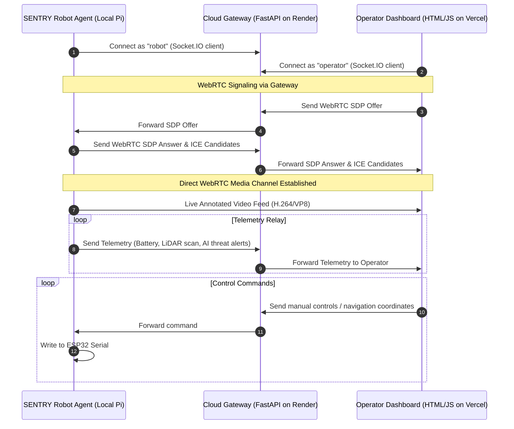

# SENTRY Remote Control & WebRTC Cloud Dashboard Integration Plan

This plan outlines the architecture and execution steps for deploying an online dashboard that allows operators to control and monitor the SENTRY robot remotely.

The SENTRY robot (behind a local NAT/firewall) establishes an outbound persistent connection to a public Cloud Gateway. Operators access a public dashboard and communicate with the robot through this gateway. WebRTC signaling messages are relayed through the gateway to establish a direct low-latency video stream.

---

## Technical Decisions

* **Language & Frameworks:** 
  * **Backend Gateway:** Python (FastAPI + `python-socketio` server).
  * **Frontend Dashboard:** Vanilla HTML, CSS, and JS.
* **Hosting Platforms:**
  * **Gateway:** Render (as a persistent WebSockets/Socket.IO service).
  * **Dashboard:** Render or Vercel (static asset hosting).
* **WebRTC Configuration:** Simple STUN configuration (using standard public Google STUN servers).
* **Security:** Ignored for this phase (development/testing focus).

---

## System Architecture Diagram

---

## Proposed Component Changes

### Component 1: Cloud Gateway & Signaling Server (`cloud-gateway/`) [NEW]
A Python FastAPI server that manages real-time messaging between the robot and operator dashboard.

#### [NEW] [`main.py`](file:///home/abdulbasit/Documents/sentry/cloud-gateway/main.py)
* Runs FastAPI + `python-socketio` server.
* Handles `/socket.io/` connections.
* Manages client registration (`robot` vs `operator`).
* Relays events: `control`, `navigate`, `telemetry`, `webrtc_signal`.

#### [NEW] [`requirements.txt`](file:///home/abdulbasit/Documents/sentry/cloud-gateway/requirements.txt)
* List of dependencies: `fastapi`, `uvicorn`, `python-socketio`, `bidict`.

---

### Component 2: Cloud Dashboard Frontend (`cloud-dashboard/`) [NEW]
A lightweight, styled static webpage that operators load in their browser to control the robot.

#### [NEW] [`index.html`](file:///home/abdulbasit/Documents/sentry/cloud-dashboard/index.html)
* High-performance HTML interface using the SENTRY retro-glowing styling.
* Houses the `<video>` element for WebRTC streaming.
* Houses the 2D Canvas for rendering the LiDAR scan points.
* Includes navigation inputs and teleoperation D-Pad controls.

#### [NEW] [`app.js`](file:///home/abdulbasit/Documents/sentry/cloud-dashboard/app.js)
* Connects to the Cloud Gateway via Socket.IO client.
* Implements WebRTC peer connection creation with standard Google STUN servers (`stun:stun.l.google.com:19302`).
* Renders telemetry state and LiDAR scans on canvas.
* Binds teleoperation controls to socket emissions.

#### [NEW] [`style.css`](file:///home/abdulbasit/Documents/sentry/cloud-dashboard/style.css)
* Custom dark cybernetic theme matching the local SENTRY interfaces.

---

### Component 3: Robot Cloud Agent (`obj/cloud_agent.py`) [NEW]
A Python script running on the SENTRY machine that connects to the cloud gateway.

#### [NEW] [`cloud_agent.py`](file:///home/abdulbasit/Documents/sentry/obj/cloud_agent.py)
* Uses `socketio.Client` to connect to the public Cloud Gateway URL.
* Integrates with `aiortc` to stream local camera frames.
* Monitors local `lidar.py` and `battery.py` telemetry and streams it to the cloud.
* Listens for incoming commands and calls the local `esp32.move()` or `navigate()` routines.

---

## Verification Plan

### Stage 1: Simulated Local Integration Test
1. **Launch Cloud Gateway:** Run `python cloud-gateway/main.py` locally on port `9000`.
2. **Launch SENTRY Agent in Simulation:** Run `python obj/main.py` in simulation mode, configuring the new `cloud_agent.py` to point to `http://localhost:9000`.
3. **Launch Dashboard:** Open `cloud-dashboard/index.html` in a web browser, point the gateway address to `http://localhost:9000`, and confirm:
   * Telemetry (battery, LiDAR scans) is successfully routed from robot agent -> gateway -> dashboard.
   * D-pad buttons send control commands from dashboard -> gateway -> robot agent.
   * WebRTC video connection initializes and plays simulated camera frames.

### Stage 2: Cloud Deployment & NAT Traversal Test
1. Deploy `cloud-gateway` to Render.
2. Open the dashboard from a different network (e.g., cell network data) and verify connectivity and control over the robot.
